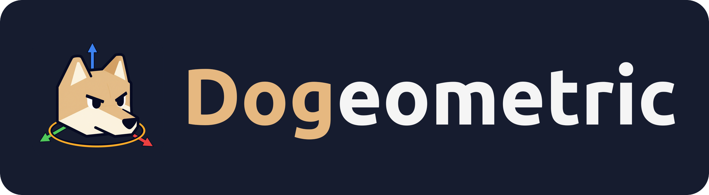

A private, behaviour-for-behaviour copy of SketchUp 2021, built with Godot 4.7 (C#/.NET 8).
Main use: precise 3D modelling of electronic enclosures and similar parts for 3D printing.

## Layout

| Path | What |
|---|---|
| `src/Dogeometric.Core` | Engine-independent core: double-precision geometry (mm, Z-up), camera/navigation maths, units. No Godot dependency. |
| `tests/Dogeometric.Core.Tests` | xunit tests for the core. |
| `app/` | Godot project: viewport, tools, menus, panels. |
| `app/data/sketchup_commands.json` | SketchUp's menu tree, command descriptions and default shortcuts (generated). |
| `docs/feature-inventory.md` | Every SketchUp feature, with priority. |
| `docs/architecture.md` | How the pieces fit. |
| `research/` | Extraction scripts and data pulled from the SketchUp 2021 install. |

## Build and run

```bash
dotnet build Dogeometric.sln
~/Godot/godot.x86_64 --path app
```

Tests: `dotnet test tests/Dogeometric.Core.Tests` (also `Dogeometric.Formats.Tests` and `Dogeometric.Solids.Tests`).

Linux release: `scripts/release-linux.sh` (needs Godot's .NET export templates and `tools/native/build-manifold.sh` run once).

## Decisions

- Native format `.dog`; open `.skp`; import/export open formats (STL, OBJ, glTF…); STL export of the selection or the whole model.
- Metric and imperial units (Architectural, Engineering, Fractional), as SketchUp's Model Info › Units.
- SketchUp's behaviour is the spec. When in doubt, check SketchUp 2021 and measure it.

## Third-party libraries

| Library | Licence | Used for |
|---|---|---|
| [OpenSKP](https://github.com/iamahsanmehmood/openskp) (vendored in `third_party/OpenSkp`) | MIT | Reading and writing `.skp` |
| [Manifold](https://github.com/elalish/manifold) (built by `tools/native/build-manifold.sh`) | Apache-2.0 | Solid Tools booleans |
| [ACadSharp](https://github.com/DomCR/ACadSharp) (NuGet) | MIT | DWG import and export |

## Licence

GPL-3.0-or-later; see `LICENSE`.

The project follows the guidelines of Cidwel's
[LLM Manifesto](https://cidwel.com/blog/llm_manifesto.html).

Dogeometric is an independent project. It is not affiliated with, endorsed by or connected to Trimble Inc.
SketchUp is a trademark of Trimble Inc.; the name is used here only to describe what Dogeometric is compatible with.
